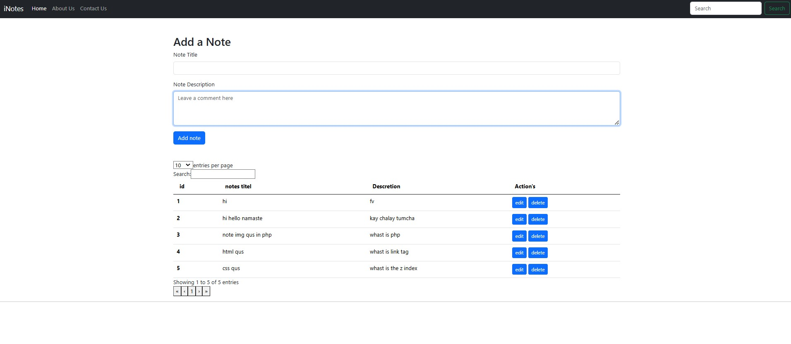

## Notepad

A simple notepad web application where users can manage notes. This project allows users to create, edit, and delete notes in a simple and user-friendly interface.

## Features

- **Display Notes**: View all existing notes with titles and descriptions.
- **Edit Notes**: Modify the title or description of any note.
- **Delete Notes**: Remove notes from the list permanently.
- **Responsive Design**: Works well on both desktop and mobile devices.

## Project Structure

```
ladevivek33-notepad/
├── README.md          # Project documentation
├── index.php          # Main entry point for the application
```

### `index.php`

This is the main file that handles the core functionality of the notepad. It fetches the notes from the database, displays them in a table, and provides options for editing or deleting notes.

### Database Connection

Ensure your MySQL or MariaDB server is running and your database is configured correctly. The connection details should be specified within the `index.php` file or a separate configuration file (depending on how it's structured).

### Screenshots

Here's a preview of what the app looks like:



> *Note: The screenshot should show the main page of the notepad, where users can see their list of notes, and interact with the "edit" and "delete" buttons.*

## Installation

1. Clone the repository or download the project folder.
2. Ensure you have PHP and MySQL/MariaDB set up on your local machine or server.
3. Create a database and import the necessary tables for storing the notes.
4. Update the database connection credentials in `index.php` as needed.
5. Open `index.php` in your browser to start using the application.

## Usage

- **View Notes**: Upon loading the `index.php`, all the notes will be displayed in a table format.
- **Edit Notes**: Click on the "edit" button next to a note to modify its title or description.
- **Delete Notes**: Click on the "delete" button to remove a note from the list.

## License

This project is licensed under the MIT License - see the [LICENSE](LICENSE) file for details.

## Acknowledgments

- Inspired by various simple note-taking applications.
- Uses `mysqli` for database interaction.
- Responsive design using Bootstrap.

